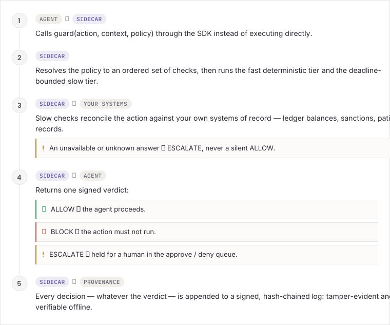
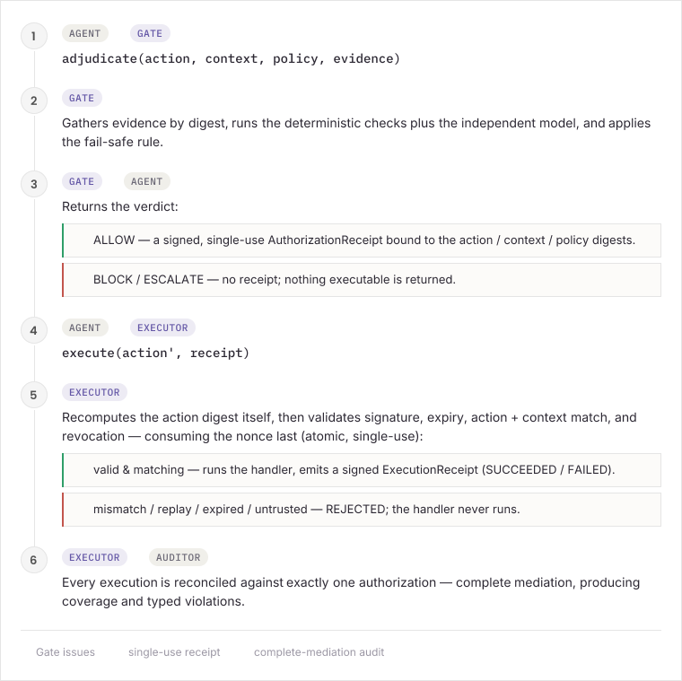

<p align="center">
  <picture>
    <source media="(prefers-color-scheme: dark)" srcset="assets/sentinel-mark-dark.svg" />
    
  </picture>
</p>

<h1 align="center">Sentinel</h1>

<p align="center">
  <strong>The independent action-gate for AI agents.</strong><br />
  Independent by design, fail-safe by default, auditable end to end.
</p>

<p align="center">
  
  
  
</p>

## Why it exists

When an agent is about to do something irreversible — move money, write a record, send a mail, close a ticket — there is usually **no independent, buyer-owned check** between the decision and the action. Teams hand-roll brittle guards or trust the model vendor's own "recovery," which an auditor can't accept (a vendor certifying its own model is a conflict of interest). Sentinel is that independent gate, signing an auditor-grade receipt for every decision — and it gets **more** valuable as agents are trusted with higher-stakes actions.

## Architecture

<p align="center">
  <picture>
    <source media="(prefers-color-scheme: dark)" srcset="assets/architecture-dark.svg" />
    
  </picture>
</p>

**Trust model:** the sidecar is a separate trust boundary from the agent. It holds the policy, renders the verdict, and signs the record with a key the agent never sees. The agent that proposes an action never signs off on it.

## Checks (run as a fast sync tier + a slow async tier with a deadline)

| Check                       | Tier | What it does                                                                                                    |
| --------------------------- | ---- | --------------------------------------------------------------------------------------------------------------- |
| `schema`                    | fast | JSON-Schema validation of the action payload                                                                    |
| `policy:<id>`               | fast | Declarative, sandboxed rule DSL → allow / block / require-approval                                              |
| `data-boundary`             | fast | Blocks PII/PHI routed to a non-cleared provider/region                                                          |
| `reconcile:<field>`         | slow | Reconciles a number (e.g. amount) against a ground-truth source; **escalates** if the source is unavailable     |
| `counterparty-sanctions`    | slow | Ledger-backed sanctioned-counterparty denial                                                                    |
| `second-opinion:<provider>` | slow | An **independent** model (Claude/GPT) re-checks; disagreement → ESCALATE; provider error → ESCALATE (fail-safe) |

Aggregation precedence: **BLOCK > ESCALATE > ALLOW**. A fast BLOCK short-circuits the slow tier (no wasted model spend).

## Install the CLI

The `sentinel` CLI scaffolds, runs, and verifies a gate (`sentinel init` / `start` / `keygen` / `verify`).
The native install is a **standalone binary — no Node.js required.**

**macOS, Linux, WSL:**

```bash
curl -fsSL https://montanalabs.ai/sentinel/install.sh | bash
```

**Windows PowerShell:**

```powershell
irm https://montanalabs.ai/sentinel/install.ps1 | iex
```

**Windows CMD:**

```bat
curl -fsSL https://montanalabs.ai/sentinel/install.cmd -o install.cmd && install.cmd
```

**Docker** — `docker run -p 4000:4000 --env-file .env ghcr.io/montanalabs/sentinel:latest`
(see [Deploying](./docs/deploying.md)).

_Homebrew and WinGet packages are planned — for now use the install scripts above or Docker._

> The `montanalabs.ai/sentinel/install.*` URLs redirect to the scripts in this repo. If a redirect
> isn't reachable, install directly from GitHub:
> - **sh** (macOS/Linux/WSL): `curl -fsSL https://raw.githubusercontent.com/montanalabs/sentinel/main/scripts/install.sh | bash`
> - **PowerShell**: `irm https://raw.githubusercontent.com/montanalabs/sentinel/main/scripts/install.ps1 | iex`
> - **CMD**: `curl -fsSL https://raw.githubusercontent.com/montanalabs/sentinel/main/scripts/install.cmd -o install.cmd && install.cmd`

Then: `sentinel init my-gate` to scaffold a project, or `sentinel start` to run the sidecar.

## Documentation

- **[Self-hosting Sentinel](./docs/self-hosting.md)** — run the sidecar in your own environment
- **[Deploying in production](./docs/deploying.md)** — EC2, EKS/Kubernetes, ECS (with a ready k8s manifest)
- **[Adjudication protocol](./docs/adjudication-protocol.md)** — execution-bound receipts, the flow diagram, and the threat model
- **TypeScript SDK** (`@montanalabs/sentinel` on npm) · **Python SDK** (`montanalabs-sentinel` on PyPI) — the thin clients your agent imports to call the gate (published as separate packages)

## Run locally (clone → start)

**Option A — Docker (with Postgres), one command:**

```bash
git clone <repo> && cd sentinel
docker compose up --build            # gate API on http://localhost:4000
```

No API keys needed (defaults to the `mock` second-opinion provider). Add a `.env` with real keys to use Anthropic/OpenAI.

**Option B — Node, no Docker (in-memory):**

```bash
git clone <repo> && cd sentinel
npm install
npm run sidecar                      # gate API on http://localhost:4000  (in-memory store, mock provider)
```

Then send your first gated action — see **[docs/getting-started.md](./docs/getting-started.md)**.

## Quick start (development)

```bash
npm install
cp .env.example .env          # add ANTHROPIC_API_KEY / OPENAI_API_KEY (or keep provider=mock)
npm test                      # 385 unit tests, no external services
npm run demo                  # boots a real sidecar, drives it over HTTP end-to-end
sentinel init my-gate     # scaffold a customized self-host project
```

### Run the sidecar

```bash
npm run sidecar               # listens on SENTINEL_SIDECAR_PORT (default 4000)
```

Drive it over the HTTP API: `POST /v1/guard` to gate an action, `GET /v1/records` for the signed decision log, `GET /v1/verify` to check the chain, `GET /v1/analytics` for allow/block/escalate rates, and the `/v1/escalations` endpoints to review and resolve holds (each resolution appends a signed `human.review` record).

### Use the SDK from an agent

The agent-side SDK is a separate, **dependency-free** package — `@montanalabs/sentinel` (npm) — so installing it in an agent pulls in no server/DB/model libraries:

```ts
import { SentinelClient, Action } from "@montanalabs/sentinel"; // zero runtime deps

const sentinel = new SentinelClient({ endpoint: "http://localhost:4000" }); // fail-closed by default

const action = Action.payment({
  amount: 42_000,
  from: "acct_ops",
  to: "vendor_42",
});
const decision = await sentinel.guard(
  action,
  { runId, provider: "anthropic" },
  "fintech.payments",
);

if (SentinelClient.allowed(decision)) {
  await executePayment(action); // only runs on ALLOW
} else {
  handle(decision); // BLOCK reason, or ESCALATE -> review queue (decision.escalationId)
}
```

### HTTP API

| Method & path                                                            | Purpose                                                     |
| ------------------------------------------------------------------------ | ----------------------------------------------------------- |
| `POST /v1/guard`                                                         | Gate one action → decision (+ `escalationId` when ESCALATE) |
| `POST /v1/guard/batch`                                                   | Gate a multi-agent fan-out in one linked chain              |
| `GET /v1/records`                                                        | Query provenance (filters: `verdict`, `tenant`, `runId`, `since`, `until`, `limit`, `offset`) |
| `GET /v1/records/:id`                                                    | One record                                                  |
| `GET /v1/verify`                                                         | Verify the whole hash-chain is intact                       |
| `GET /v1/export`                                                         | Export records (feed a GRC platform)                        |
| `GET /v1/escalations[?status=pending]`                                   | Review queue                                                |
| `POST /v1/escalations/:id/resolve`                                       | Human approve/deny → appends a signed `human.review` record |

## Rate limiting & backpressure

The sidecar can enforce a global token-bucket rate limit (429) and a concurrency cap (503) on `/v1/*` (liveness `/healthz` is exempt):

```bash
SENTINEL_RATE_LIMIT_BURST=200 SENTINEL_RATE_LIMIT_RPS=100 SENTINEL_MAX_CONCURRENT=64 npm run sidecar
```

## Packaging

`npm run build` emits `dist/`; `npm run build:binary` bundles it into a standalone executable. The server is distributed as a **standalone binary** (the install scripts above) and a **Docker image** (`ghcr.io/montanalabs/sentinel`) — not published to npm. The agent-side client *is* a separate npm package (`@montanalabs/sentinel`).

## Provenance

Every decision is an append-only, **hash-chained** record signed with **Ed25519**. `GET /v1/verify` (or `verifyChain()`) recomputes each content hash, checks the chain links, and verifies every signature — any insertion, deletion, or edit is detected. Records survive restarts: the sidecar resumes the chain from the persisted tail. Concurrency is safe at two levels: the append critical section is **serialized within an engine** (so concurrent requests to one sidecar can't corrupt the chain), and **across sidecars** a Postgres unique-seq constraint plus optimistic re-resume/retry keeps one fork-free chain (covered by a real-Postgres concurrent-writer stress test).

## Adjudication protocol (execution-bound receipts)

The core gate decides and signs a record. The optional **adjudication protocol** goes further: it turns
an `ALLOW` into a signed, single-use, expiring **authorization receipt** bound to the exact action,
context, policy, and evidence — so a downstream executor can prove the action it is about to run is the
one that was authorized, and an auditor can prove it afterward. The invariant:

> Every protected execution corresponds to **exactly one** valid authorization receipt, and the executed
> action **exactly matches** the authorized action.

<p align="center">
  <picture>
    <source media="(prefers-color-scheme: dark)" srcset="assets/adjudication-dark.svg" />
    
  </picture>
</p>

A proposal-time verifier — even an ideal independent model — cannot stop action **substitution**,
**replay**, or **forged** execution, because it gates the proposal and nothing binds execution. Binding
execution to a single-use receipt does. The evaluation harness (`eval/`, `npm run eval`) quantifies
this: an ideal independent verifier still scores 1.00 (full attack success) on those three; execution-
bound receipts drive them to 0.00, with complete-mediation audit coverage and detection at 1.00.

Enable with `SENTINEL_PROTOCOL_ENABLED=1` (additive — `/v1/guard` is unchanged). See
**[docs/adjudication-protocol.md](./docs/adjudication-protocol.md)** for the flow diagram, the full
threat model, and its explicit non-goals.

## Policy packs

Built-in vertical packs (configurable, composable):

- **`fintech.payments`** — schema, dual-control on high-value transfers, sanctioned-counterparty denial (static + ledger), balance reconciliation, second opinion.
- **`healthcare.record_write`** — schema, clinician sign-off on clinically-significant changes, PHI data-boundary, **patient-exists verification** against a clinical (FHIR-style) connector, second opinion.

```ts
import { defaultRegistry, fintechPaymentsPack } from "sentinel";
const registry = defaultRegistry(
  { ledger, provider },
  { fintech: { highValueThreshold: 25_000 } },
);
```

## Control plane

Multi-sidecar aggregation, signed-bundle distribution, GRC export, and OpenTelemetry export live in the **separate, commercial control-plane project** — not in this open-source gate. Self-hosters get the raw signed records via `GET /v1/export` to feed their own pipeline.

## Analytics & safe rollout

- `analyze(records)` — verdict rates, breakdowns, top block/escalation reasons.
- `runCoverage(records, runId)` — every gated action in a (multi-agent) run + duplicate-action detection.
- `simulate(records, candidateChecks)` — **back-test** a policy change against history without emitting records.

## Testing

```bash
npm test                      # unit tests (no external services)
docker run -d --name sentinel-pg -e POSTGRES_USER=sentinel -e POSTGRES_PASSWORD=sentinel \
  -e POSTGRES_DB=sentinel -p 5433:5432 postgres:17-alpine
npm run test:int              # integration: Postgres store + live Anthropic/OpenAI + real-HTTP boot
npm run typecheck && npm run build
```

Integration tests self-skip when their dependency (DB URL / API key) is absent.

## Project layout

```
src/
  core/         types, Action model, canonical JSON
  provenance/   Ed25519 signing, hash-chain records, verify
  store/        ProvenanceStore: in-memory + SQLite + Postgres (+ shared contract)
  checks/       schema · policy DSL · reconcile · data-boundary · predicate
  engine/       verdict engine: tiers, budget, aggregation, serialized+HA append, batch
  providers/    second-opinion: Anthropic · OpenAI · mock
  connectors/   ground-truth: static/HTTP ledger · static/FHIR clinical
  policy-packs/ registry + fintech & healthcare packs
  sidecar/      Fastify server, escalations, rate-limit, bootstrap, main
  cli/          the `sentinel` CLI: init · start · keygen · verify
  analytics/    analytics · run coverage · policy simulation
examples/demo.ts
```

## Security notes

- Keep real API keys in **`.env`** (gitignored). **Do not** put live secrets in `.env.example` (it is tracked). Rotate any key that has been committed.
- Default fail modes are **safe**: the SDK fails **closed** (BLOCK) if the sidecar is unreachable; the engine **escalates** when a slow check times out or a ground-truth source is unavailable.
- For PHI/PCI, run the sidecar in-VPC/on-prem so prompts/outputs never leave the trust boundary.

## Status

385 unit tests + integration tests, all green. The cross-model second opinion supports Anthropic
and OpenAI (or a built-in `mock` provider for offline/dev), and the provenance store supports
in-memory, SQLite, and Postgres. **You bring your own** model provider, API key, and database — set
them in your `.env` (see [Getting started](./docs/getting-started.md) and
[Self-hosting](./docs/self-hosting.md)); Sentinel ships none of these credentials.

## API stability & versioning

Sentinel follows [Semantic Versioning](https://semver.org). From **1.0.0**, these are the stable
surfaces — a breaking change to any of them means a **major** version bump:

- the **HTTP `/v1/*` API** (request/response shapes and status codes);
- the **verdict semantics** (`ALLOW` / `BLOCK` / `ESCALATE` and the `BLOCK > ESCALATE > ALLOW`
  precedence);
- the **provenance record + signature format** and the **adjudication-receipt format** — a breaking
  change here also bumps the on-disk chain version, and old chains/receipts are flagged, never
  silently accepted;
- the documented `SENTINEL_*` environment variables and the CLI commands.

These are what a deployer consumes: the standalone binary, the Docker image, and the HTTP API. The
embedding/extension API (`import { … } from 'sentinel'` for custom connectors/packs — see
[connectors.md](./docs/connectors.md)) requires running from source and is **not** yet a stabilized,
published surface; it stabilizes when the `sentinel` package is published to npm.

Internal modules (anything not in the above) may change in a minor release. Deprecations are announced
in [CHANGELOG.md](./CHANGELOG.md) at least one minor version before removal. The 0.x → 1.0.0 upgrade
carries one-time breaking changes (full-SHA-256 key id, loopback-default bind, provenance hash format)
— see the changelog.

## Contributing & security

Contributions welcome — see [CONTRIBUTING.md](./CONTRIBUTING.md) and our
[Code of Conduct](./CODE_OF_CONDUCT.md). Found a vulnerability? Please report it privately per our
[Security Policy](./SECURITY.md) rather than opening a public issue.

## License

[Apache-2.0](./LICENSE) © Montana Labs.
